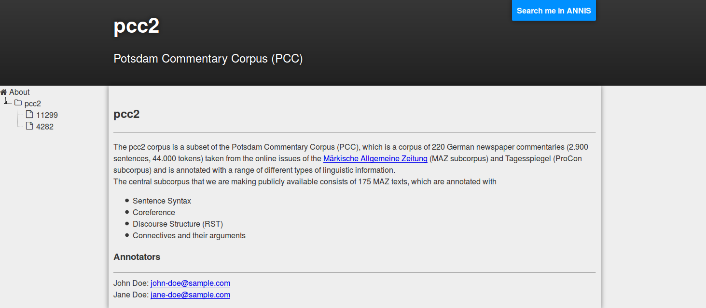

# pepperModules-SaltInfoModules
The SaltInfoExporter helps you to get an overview of your corpus. It illustrates, which annotations (names and values as well) are used and how often they occur in your entire corpus or in a single document. The SaltInfoExporter is a module to be plugged in the linguistic converter framework Pepper (see https://u.hu-berlin.de/saltnpepper). This allows, to create a corpus overview for each corpus which is processable with one of Pepper's importer modules. The module produces two outputs, an xml output for further processing and an html output for illustration.  Both outputs lists all annotations names and values and the corresponding frequencies. 


Visualizing your corpus with the SaltInfoExporter gives you the following benefits:
* listing of all corpus meta data
* all annotation names and values of your corpus at once 
* frequencies to all names and values
* direct link to single values in the corpus search and visualization system ANNIS (see: http://annis-tools.org)
* highly customizable for creating a corpus homepage via json (corpus descripton, authors, description to single annotation names and values) and css
* export to CSV format for further frequency analyzes

A more detailed description of the outputs can be found in section [SaltInfoExporter](#htmlOutput).

## Requirements
Since the here provided module is a plugin for Pepper, you need an instance of the Pepper framework. If you do not already have a running Pepper instance, click on the link below and download the latest stable version (not a SNAPSHOT):

> Note:
> Pepper is a Java based program, therefore you need to have at least Java 7 (JRE or JDK) on your system. You can download Java from https://www.oracle.com/java/index.html or http://openjdk.java.net/ .


## Install module
If this Pepper module is not yet contained in your Pepper distribution, you can easily install it. Just open a command line and enter one of the following program calls:

**Windows**
```
pepperStart.bat 
```

**Linux/Unix**
```
bash pepperStart.sh 
```

Then type in command *is* and the path from where to install the module:
```
pepper> update de.hu_berlin.german.korpling.saltnpepper::pepperModules-pepperModules-SaltInfoModules::https://korpling.german.hu-berlin.de/maven2/
```

## Usage
To use this module in your Pepper workflow, put the following lines into the workflow description file. Note the fixed order of xml elements in the workflow description file: &lt;importer/>, &lt;manipulator/>, &lt;exporter/>. The SaltInfoExporter is an importer module, which can be addressed by one of the following alternatives.
A detailed description of the Pepper workflow can be found on the [Pepper project site](https://u.hu-berlin.de/saltnpepper). 

### a) Identify the module by name

```xml
<importer name="SaltInfoExporter" path="PATH_TO_CORPUS"/>
```

```
### c) Use properties
```xml
<exporter name="SaltInfoExporter" path="PATH_TO_CORPUS">
  <property key="PROPERTY_NAME">PROPERTY_VALUE</key>
</exporter>
```

## <a name="htmlOut">HTML output</a>

The SaltInfoExporter comes with a default flat design style. For our demonstration we used the pcc2 corpus, which is a subset of the pcc corpus (see: https://www.ling.uni-potsdam.de/acl-lab/Forsch/pcc/pcc.html). The SaltInfo page of that corpus can be found [here](???).


### Name and description
On top of the site you see the name of the corpus which is 'pcc2' in our case and a short text, which could be the full name of the corpus or even a small description of the corpus. 

### Navigation
On the left you see the navigation bar, which displays a tree structure containing the root corpus, sub corpora and even all deocuments belonging to the corpus. In our sample the root corpus is the 'pcc2' corpus and the two documents '11299' and '4282'. By clicking on the small triangle next to a corpus or sub corpus name, you can collapse or expand the sub corpus structure.

### Structural part, meta data and annotations
In the center you see a bunch of different tables. One table shows the structural part of the currently selected corpus or document, that means the number of primary texts, tokens and other nodes or relations. One shows the meta data the currently selected corpus or document contains. And an unbound number of tables showing the annotation names and values and the corresponding frequencies. In Salt linguistic annotations can be differentiated into layers. For instance a morphological layer can contain a morphological annotations, a syntactic layer can contain syntactic annotations and so on. For each layer and also for all annotations which does not belong to a layer, one table is displayed.  


The left column of the table lists all annotation names used in the currently selected corpus or document: "func", "lemma", "morph" and "pos". The number in bracktes like: "func(893)" is the number of annotations having the name "func". Right to the name, there are four icons: an 'i' icon, a double sided arrow, a box and a download icon.
* the 'i' icon shows a description of the annotation name as a tooltip
* the double sided arrow expands all annotation values corresponding to the annotation value or collapses them again
* the box icon draws a box around all annotation names, to better detect blanks
* the download icon downloads all annotation values and their frequencies as CSV

The right column of the table lists all annotation values and the corresponding frequencies. Since the set of annotation values can be very huge, the table displayes just the first five values. To show all annotation values, click on the double sided arrow icon in the left column of the same row.

### Customizing the output
To customized the style of the corpus site, you can adopt the CSS file named 
```
style.css
```
which is to find in the css folder of the export. A lot of examples how to use CSS can be found everywhere in the web.

To easily customize the content of the corpus site, the SaltInfoExporter generates a file named
```
customization.json
```
which is to find in the root folder of the export. As the file ending already indicates, this file is a JSON file following the JSON syntax (see: http://json.org/). For the most entries in that file, you just need to determine attribute-value-pairs whose name and value is embraced by quotation marks. Name and value are separated by a colon. To give an example following snippet shows the definition of the little text which is displayed beyond the name of the corpus:
```json
{
    ...
    "shortDescription" : "Potsdam Commentary Corpus (PCC)"
    ...
}
```
Note that the three punctuations are not part of the file and are only used as placeholders for further entries. You need to remove them.
The showed json file leads to the following headline:


You can change the text by changing the part right to the colon ("Potsdam Commentary Corpus (PCC)"). But never change the part left of the colon, since this is the variable's name which is used by the script behind the corpus site.

#### Main page
When opening a corpus site in a browser or clicking on the little house in the navigation bar, a site opens, which briefly describes the corpus project and gives links to the annotators. For the pcc2 sample, this site looks like the following screenshot:



To adopt the description of the corpus, change the entry for the variable "description". To change the authors name and mail address, change the entry for "annotators" as shown with the following snippet:

```json
    ...
    "description" : "The pcc2 corpus is a subset of the Potsdam Commentary Corpus (PCC), which is a corpus of 220 German newspaper commentaries (2.900 sentences, 44.000 tokens) taken from the online issues of the <a href=\"http://www.maerkischeallgemeine.de/\">Märkische Allgemeine Zeitung</a> (MAZ subcorpus) and Tagesspiegel (ProCon subcorpus) and is annotated with a range of different types of linguistic information.<br/> The central subcorpus that we are making publicly available consists of 175 MAZ texts, which are annotated with: <ul><li>Sentence Syntax</li><li>Coreference</li><li>Discourse Structure (RST)</li><li>Connectives and their arguments</li></ul>",
    "annotators" : [ {"name" : "John Doe", "eMail" : "john-doe@sample.com"}, {"name" : "Jane Doe", "eMail" : "jane-doe@sample.com"}],
    ...
```

#### Tooltips
The corpus site offers you to create customized tooltips for all annotation and meta data names. For instance to give the user a detailed description about the meaning of the data. The following screenshot shows a tooltip for the annotation name 'pos'.


To add tooltips, add the following snippet to the customization.json.

```json
{
...
	"tooltips_metadata" : [
		{"name": "auhor", "tooltip": "This is the author of the primary text."}
	],
	"tooltips_annonames" : [
		{"name": "pos", "tooltip": "A part of speech is a category of words (or, more generally, of lexical items) which have similar grammatical properties."}
	],
...
}

```
#### ANNIS links
When your corpus is also available in a public accessible ANNIS instance you can add the link to the instance in the JSON file. This allows the corpus site to create links directing to the ANNIS instance. The corpus site then enables three different links to ANNIS:
1. a link in the header section of the site to the corpus in the ANNIS instance
1. a link in each annotation name to the ANNIS instance 
1. a link in each annotation value to the ANNIS instance

Clicking on one of the links automatically creates an ANNIS query and opens it in a new tab. To enable the linking, you need to add the following entry to the JSON file and write the correct link. For our sample, we use the ANNIS instance located at https://korpling.german.hu-berlin.de/annis3/.
```json
{
    ...
    "annisLink" : "https://korpling.german.hu-berlin.de/annis3/"
    ...
}
```
#### Impressum
The corpus site comes with a default automatically generated impressum. Therefore this impressum only contains some dummy values and needs to be adopted. You should adopt the impressum for your specific dates, like who is in charge for that site etc. The file to be adopted is an html file named 'impressum.html' which is to find in the root folder of the corpus site. The following snippet shows the important parts for adoption:
```html
    <br />
    INSTITUTION
    <br />
    ADDRESS
    <br />
    <h2>Represented by</h2>
    PERSON
    <br />
    <h2>Contact</h2>
    Telephone: PHONE
    <br />
    E-Mail:
    <a href="EMAIL">EMAIL</a>
    <br />
    Internetadresse:
    <a href="WEB_ADDRESS" target="_blank">WEB_ADDRESS</a>
    <br />
```

Please change the placeholders: INSTITUTION, ADDRESS, PERSON, PHONE, EMAIL and WEB_ADDRESS with your individual dates.

#### Browsers
The corpus site is optimized for the Mozilla Firefox (see: https://www.mozilla.org/en-US/firefox/). 
For running the site under Chrome (see: http://www.google.com/chrome) and may be even other browsers, you need to access the site via http. This is because of the cross origin policy of some brother, which prohibit to access URL using the file scheme ("file:/"). To solve that problem you can install a webserver on your local mashine, upload the corpus site to an accessible webserver or start the browser (only for Chorme)  with additional arguments:
```
chromium-browser --disable-web-security
```

### XML output
The xml output produces two different kinds of files. One representing the corpus structure and the other representing the document structure. There is just one file representing the corpus structure ('salt-project.xml') and a bunch files representing the document structure of the single documents. These files are organized in a folder structure, following the corpus structure. Imagine a corpus named 'corp' having a subcorpus named 'sub' which contains the two documents 'doc1' and 'doc2'. The file structure looks as follows:
```
|
+-salt-project.xml
|
+-myCorpus.xml
|
+-myCorpus
  |
  +sub.xml
  |
  +-sub
    |
    +-doc1.xml
    |
    +-doc2.xml
```
The 'salt-project.xml' is similar to the following sample:
```xml
<saltProjectInfo sName="myCorpus" generatedOn="2015-03-20 17:29:42">
    <sCorpusInfo sName="myCorpus" id="salt:/myCorpus" rel-location="/myCorpus.xml">
        <sDocumentInfo sName="sub" id="salt:/myCorpus/sub" rel-location="/myCorpus/sub.xml"/>
        <sDocumentInfo sName="doc1" id="salt:/myCorpus/sub/doc1" rel-location="/myCorpus/sub/doc1.xml"/>
        <sDocumentInfo sName="doc2" id="salt:/myCorpus/sub/doc2" rel-location="/myCorpus/sub/doc2.xml"/>
    </sCorpusInfo>
</saltProjectInfo>
```
The xml files for document structures are similar to the following sample:

```xml
<?xml version="1.0" ?>
<sCorpusInfo generatedOn="2015-03-20 17:29:42" sName="pcc2" id="salt:/pcc2">
    <metaDataInfo>
        <entry key="author">...</entry>
        <!-- ... -->
    </metaDataInfo>
    <structuralInfo>
        <entry key="SNode">995</entry>
        <!-- ... -->
    </structuralInfo>
    <sAnnotationInfo sName="func" occurrence="893">
        <sValue occurrence="9">app</sValue>
        <sValue occurrence="3">AG</sValue>
        <sValue occurrence="65">MO</sValue>
        <!-- ... -->
    </sAnnotationInfo>
    <!-- ... -->
    </sLayerInfo>
    <sLayerInfo sName="exmaralda">
        <sAnnotationInfo sName="Sent" occurrence="28">
            <sValue occurrence="28">s</sValue>
            <!-- ... -->
        </sAnnotationInfo>
        <!-- ... -->
    </sLayerInfo>
    <!-- ... -->
</sCorpusInfo>
```

## Contribute
Since this Pepper module is under a free license, please feel free to fork it from github and improve the module. If you even think that others can benefit from your improvements, don't hesitate to make a pull request, so that your changes can be merged.
If you have found any bugs, or have some feature request, please open an issue on github. If you need any help, please write an e-mail to saltnpepper@lists.hu-berlin.de .

## Funders
This project has been funded by the [department of corpus linguistics and morphology](https://www.linguistik.hu-berlin.de/institut/professuren/korpuslinguistik/) of the Humboldt-Universität zu Berlin and the [Sonderforschungsbereich 632](https://www.sfb632.uni-potsdam.de/en/). 

## License
  Copyright 2009 Humboldt-Universität zu Berlin.

  Licensed under the Apache License, Version 2.0 (the "License");
  you may not use this file except in compliance with the License.
  You may obtain a copy of the License at
 
  http://www.apache.org/licenses/LICENSE-2.0

  Unless required by applicable law or agreed to in writing, software
  distributed under the License is distributed on an "AS IS" BASIS,
  WITHOUT WARRANTIES OR CONDITIONS OF ANY KIND, either express or implied.
  See the License for the specific language governing permissions and
  limitations under the License.
